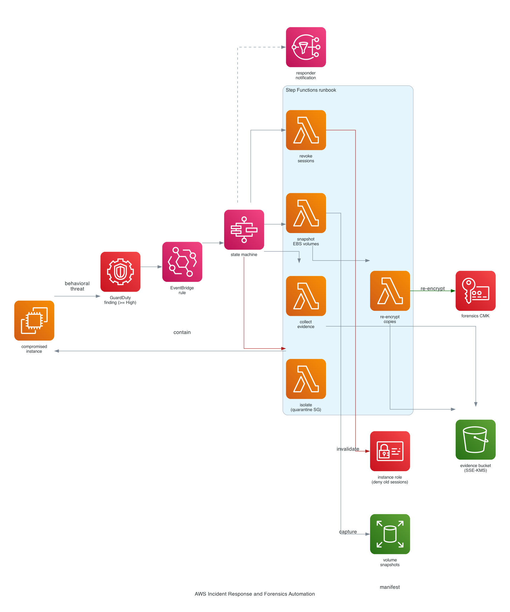

# AWS Incident Response and Forensics Automation

A GuardDuty finding against an EC2 instance triggers a Step Functions runbook
that contains the host, captures evidence, and revokes leaked credentials
without a human in the hot path. The steps run in the order an incident
responder would run them by hand, encoded as state so they run the same way
every time and leave an auditable trail.



## Cost and teardown risk, up front

Built to deploy, demo, and destroy. Everything is serverless or tiny:

- Step Functions, Lambda, EventBridge, SNS: effectively free at demo volume.
- GuardDuty: free 30-day trial on a new detector; set `create_guardduty_detector = false` if the account already has one enabled.
- One `t3.micro` demo victim and a couple of 8 GiB snapshots: a few cents.
- The forensics KMS key: $1/month prorated, plus a 7-day deletion window on destroy (unbilled while pending).

Rough cost for a deploy-demo-destroy session: under a quarter. The only thing
that lingers after `terraform destroy` is the KMS key in its 7-day pending
deletion window, which is free.

## Why this order

Isolation runs **before** evidence capture on purpose. A live attacker on the
box is doing damage every second; cutting network access the instant a
high-severity finding lands outranks the few seconds of forensic completeness
lost by not snapshotting first. Volatile state (running processes, memory, open
sockets) survives an SG swap, so nothing is lost by containing first anyway.
Credential revocation runs after evidence capture because it mutates the
instance role, and we want the role state recorded before we change it.

## What the runbook does

1. **ExtractContext** parses the finding, resolves the instance, and decides
   whether to act (severity gate). Real `aws.guardduty` findings and synthetic
   `forensics.demo` findings are handled identically.
2. **IsolateInstance** swaps every ENI on the instance to a quarantine security
   group with no ingress and no egress, then tags the instance as under
   investigation. The host is cut off in both directions but left running.
3. **SnapshotEvidence** snapshots every attached EBS volume. These source
   snapshots inherit the volume's encryption state (often none).
4. **EncryptSnapshots** copies each source snapshot re-encrypted with a
   dedicated forensics KMS CMK, moving evidence into a custody domain governed
   by a key only the pipeline and account admins control. A bounded wait loop
   (`WaitForSnapshots` / `CheckSnapshots`) polls the copies to completion.
5. **RevokeCredentials** attaches a deny-all policy conditioned on
   `aws:TokenIssueTime` to the instance role, invalidating every temporary
   credential issued before now. This kills any STS session an attacker
   exfiltrated from the metadata service, which isolating the host does not do.
6. **CollectEvidence** writes a JSON manifest (finding, containment actions,
   evidence snapshot ids, captured console output) to an SSE-KMS S3 bucket,
   then deletes the unencrypted source snapshots so only encrypted evidence
   survives.

Every terminal path publishes to SNS: a `[CONTAINED]` summary on success or a
`[FAILED]` notice with the full execution state on error.

## Containment boundary

The one destructive capability in the pipeline, credential revocation, is
fenced two ways that agree:

- The `revoke_credentials` Lambda's IAM policy only allows `iam:PutRolePolicy`
  on roles under the `/forensics-demo/` path.
- The function re-checks the role's path at runtime before mutating it.

So even a bug in the function cannot attach a deny policy to an arbitrary role.
In a real deployment you widen the path to the paths your workloads actually
use, deliberately, rather than granting `iam:PutRolePolicy` on `*`.

## Least privilege

Each of the seven Lambdas has its own execution role with only that step's
permissions. The snapshot function cannot touch KMS; the revocation function
cannot read S3; the evidence collector can delete only snapshots tagged
`forensics:stage=source`. A compromise of any single function is contained to
that function's slice.

## DevSecOps pipeline

GitHub Actions gates every push and PR (`.github/workflows/ci.yml`):

- **ruff** lints the Lambda source.
- **bandit** runs Python SAST, blocking on medium severity and up.
- **terraform fmt + validate** enforce formatting and correctness.
- **checkov** scans the Terraform for HIGH/CRITICAL misconfigurations.
- **gitleaks** blocks committed secrets.

## Deploy

```sh
cd terraform
cp backend.hcl.example backend.hcl   # fill in your state bucket
terraform init -backend-config=backend.hcl
terraform apply -var="alert_email=you@example.com"
```

Confirm the SNS subscription email so notifications arrive. GuardDuty takes a
few minutes to become active on a fresh detector; the synthetic demo finding
does not depend on it.

## Demo

```sh
scripts/demo.sh          # injects a synthetic High finding for the victim
scripts/validate.sh      # asserts the seven outcomes below
```

`validate.sh` confirms: the execution succeeded, the instance is on the
quarantine SG and tagged, an encrypted evidence snapshot exists, the
unencrypted source snapshots were cleaned up, the instance role carries the
revocation policy, and an evidence manifest landed in S3.

## Destroy

```sh
cd terraform
terraform destroy -var="alert_email=you@example.com"
```

`force_destroy` is set on the evidence bucket so teardown is clean. The KMS key
enters a 7-day deletion window (free). A production build would instead keep
evidence in an Object Lock bucket in a separate security account with a
lifecycle to Glacier, which is a retention choice, not a technical limit.

## Production notes

- Evidence would live in a dedicated security/log-archive account, not the
  workload account, so a compromise of the workload account cannot reach it.
- The evidence bucket would use Object Lock in compliance mode for legal hold.
- Snapshots would be shared to the forensics account and analyzed from a
  clean-room investigation instance rather than kept in place.
- The revocation path would widen from `/forensics-demo/` to the real workload
  role paths, reviewed deliberately.
